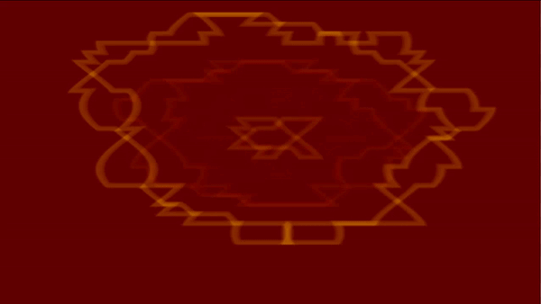
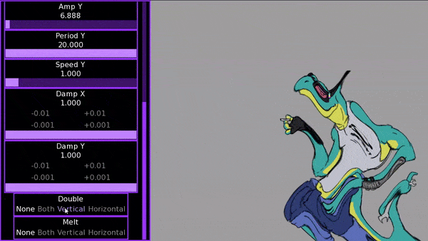

# Renpy Wave Shader
 Module for Renpy to allow for distorting images and text with wavey effects

This is a follow up to my WaveRendering module from a year ago. This time using a shader to achieve the wave effects, making it less CPU dependant and more stable as a result.






## Installation Instructions
As usual for my projects, you simply need to take the [**wave_shader.rpy**](https://github.com/SoDaRa/RenpyWaveShader/blob/main/game/wave_shader.rpy) and put it in the game folder (or subfolder of it) of your project to have the code needed to run it. I've also included a [**wavey_tag.rpy**](https://github.com/SoDaRa/RenpyWaveShader/blob/main/game/wavey_tag.rpy) as well if you would want to apply it as a text tag. Examples for how to use it can be found in the demo project's script.

Note: You will need [kinetic_text_tags.rpy](https://github.com/SoDaRa/RenpyWaveShader/blob/main/game/kinetic_text_tags.rpy) in order for wavey_tag.rpy to work.

## How it works
The main way I have it setup to make it easy to add the shader is by using the `function` statement in ATL to have a function that sets up the transform and applies all the parameters for you. This is done by using my WaveShader class, which has a `__call__` function, so that when ATL tries to use it as a function, it can handle the transform. That said, the shader can be applied by yourself manually, but you'll have to instantiate the uniform parameters for the shader yourself. From there, it updates u_shader_time itself using the animation_time parameter that ATL provides to the function, which allows it up update smoothly. The `advance_time` function is something I plan on using if I develop further shaders so that all of them can piggyback off of it and all use it for their time updates. 

## Important Notes
Because this function has to keep updating the shader time, it will never pass control onto ATL code below it. So if you want to apply the WaveShader and do some other ATL, I recommend you split it up into parallel blocks. Such as:
```
show my_image:
    parallel:
        # Your ATL
    parallel:
        function WaveShader()
```
This should avoid most issues you might be having, unless you're using another shader on the displayable, in which case you may want to override this behavior. Though, if you're using other shaders, I assume you probably already know what you're doing. If I ever make more though, I'll be sure to include how to make them work together, if it would make sense to do so.

## Credits
- The team behind Minotaur Hotel for being cool with me using their sprite for demo purposes. Check 'em out at [https://minoh.itch.io/minotaur-hotel](https://minoh.itch.io/minotaur-hotel)
- [Deep-fold](https://deep-fold.itch.io/) for his [pixel art space background generator](https://deep-fold.itch.io/space-background-generator).
- Earthbound backgrounds copyrighted to Nintendo. Please don't sue.
